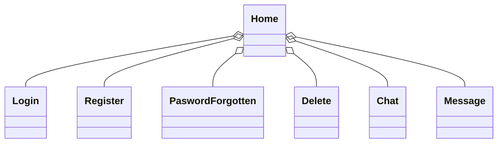
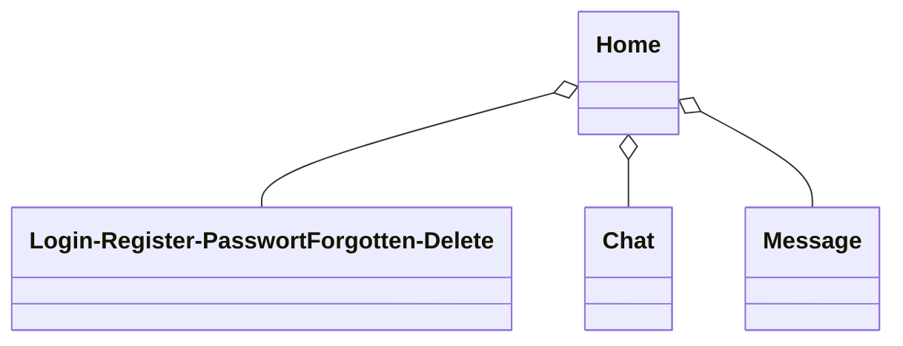

# Dokumentation Semesterprojekt Thor

## Softwaredesign (Architektur) 
Das Chat-Programm besteht aus einer Client-Server-Architektur.Diese wurde implementiert mit zwei Clients, einer WPF-Anwendung geschrieben in C# und einer WebApp umgesetzt mit JavaScript, CSS und HTML. Der Server (welcher auf Spring Boot basiert) kommunizieren. Die Daten werden alle in einer MongoDB-Datenbank gespeichert.

## Beschreibung der Software 

## API-Beschreibung 
Die API ist eine Spring Boot Rest API welche über Endpoints es ermöglicht 
## Verwendung der API 

## Diagramme

### Klassendiagramm des WPF-Clients


### Klassendiagramm des WebApp-Clients


### Klassendiagramm des Spring-Boot Servers
```
classDiagram
    class ChatController {
        +ChatService chatService
        +createChat(List<String> participants) Chat
        +sendMessage(String chatId, Message message) Chat
        +updateChat(String chatId, Chat chat) Chat
        +getChat(String chatId) Chat
        +deleteChat(String data) User
    }

    class UserController {
        +UserService userService
        +getUsers() List<User>
        +getUserByName_And_Password(String name, String password) User
        +getUserByName(String name) User
        +addUser(User user) User
        +addContact(String data) User
        +addChat(String data) User
        +deleteUser(String username)
    }

    ChatController --> ChatService
    UserController --> UserService
classDiagram
    class ChatService {
        +ChatRepository chatRepository
        +UserRepository userRepository
        +createChat(List<String> participants) Chat
        +sendMessage(String chatId, Message message) Chat
        +updateChat(String chatId, Chat updatedChat) Chat
        +getChat(String chatId) Chat
        +deleteChat(String data) User
    }

    class UserService {
        +UserRepository userRepository
        +getUsers() List<User>
        +getNewContact(String username) User
        +getUser(String username, String password) User
        +createUser(User user) User
        +newContact(String data) User
        +newChat(String data) User
        +deleteUser(String username)
    }

    ChatService --> ChatRepository
    ChatService --> UserRepository
    UserService --> UserRepository

classDiagram
    class Chat {
        +String id
        +List<String> participants
        +List<Message> messages
    }

    class Message {
        +String id
        +String sender
        +String content
    }

    class User {
        +String username
        +String password
        +List<String> chat_IDs
        +List<String> contacts
    }

    Chat --> Message
    User --> Chat

classDiagram
    class ChatRepository {
        +findByParticipantsContaining(String userId) List<Chat>
    }

    class UserRepository {
        +findByUsername(String username) User
    }

    ChatRepository --> Chat
    UserRepository --> User

classDiagram
    class RescourceNotFoundException {
        +RescourceNotFoundException(String message)
    }

    RescourceNotFoundException --> RuntimeException


```


## Diskussion der Ergebnisse


## Quellenverzeichnis

### WPF-Client

#### [WPF](https://learn.microsoft.com/en-us/visualstudio/get-started/csharp/tutorial-wpf?view=vs-2022)
#### [C#](https://www.w3schools.com/cs/index.php)

### Webapp-Client

#### [HTML & CSS](https://www.youtube.com/watch?v=hlwlM4a5rxg&list=PL4G5QRcvyrs9OoyIGfdLnQq1ACd-NkDKU)
#### [HTML](https://www.w3schools.com/html/)
#### [CSS](https://www.w3schools.com/css/default.asp)
#### [JAVASCRIPT](https://www.w3schools.com/js/default.asp)

### Spring-Boot Rest API

#### [Spring-Boot Rest](https://www.youtube.com/watch?v=e-TIQnK2Qg4&list=PL4G5QRcvyrs9OoyIGfdLnQq1ACd-NkDKU&index=2)
#### [Spring Dependencies](https://start.spring.io/)

### IDES

#### [IntelliJ IDEA 2022.2.1](https://www.jetbrains.com/idea/download/other.html)
#### [Visual Studio Code 1.89.1](https://code.visualstudio.com/download)
#### [Visual Studio 2022 17.9.7](https://visualstudio.microsoft.com/de/thank-you-downloading-visual-studio/?sku=Community&channel=Release&version=VS2022&source=VSLandingPage&cid=2030&passive=false)
