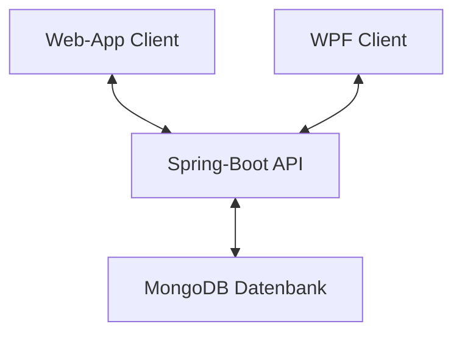
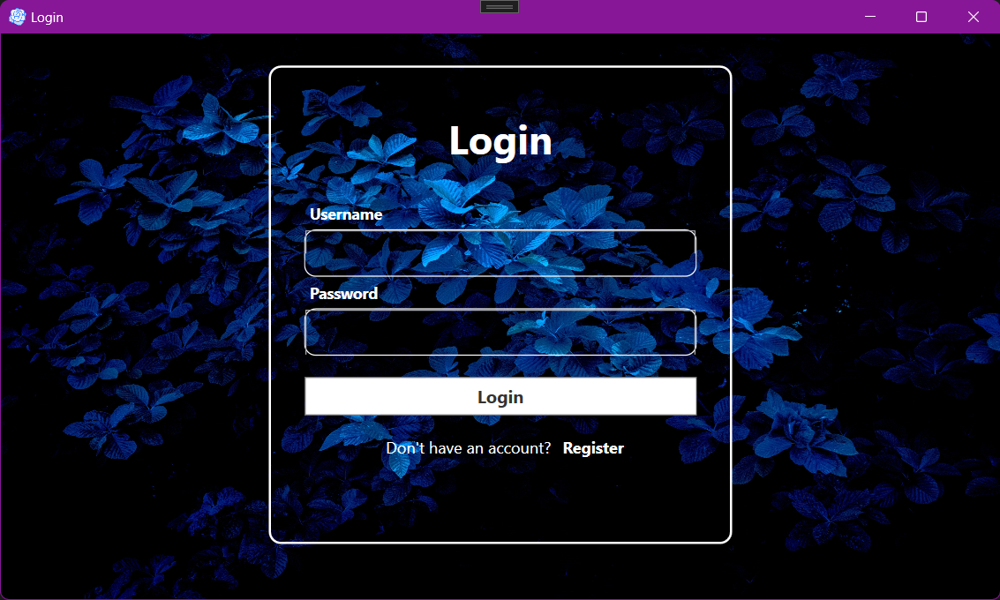
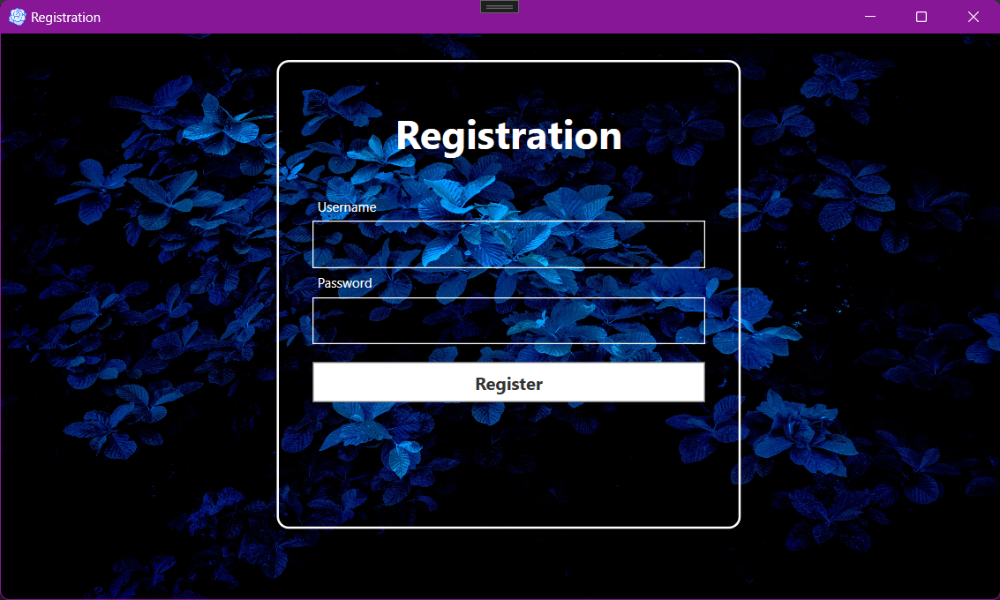
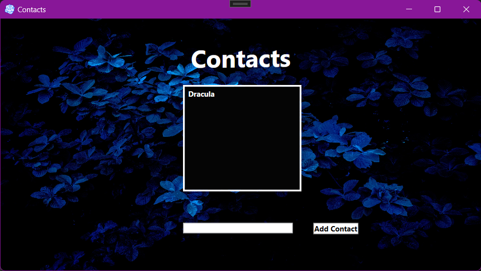
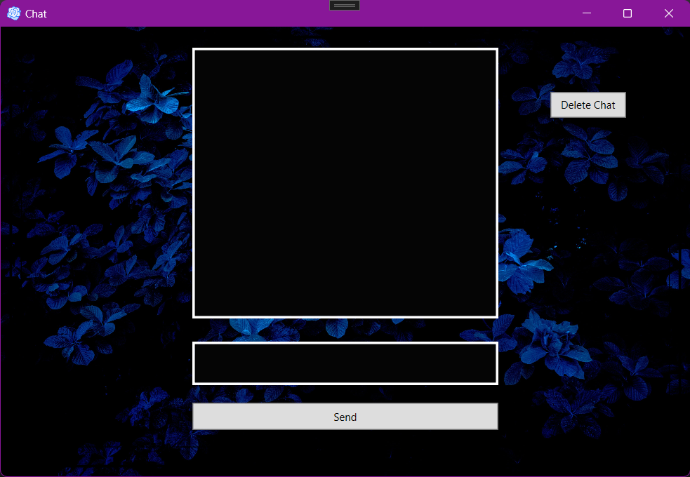
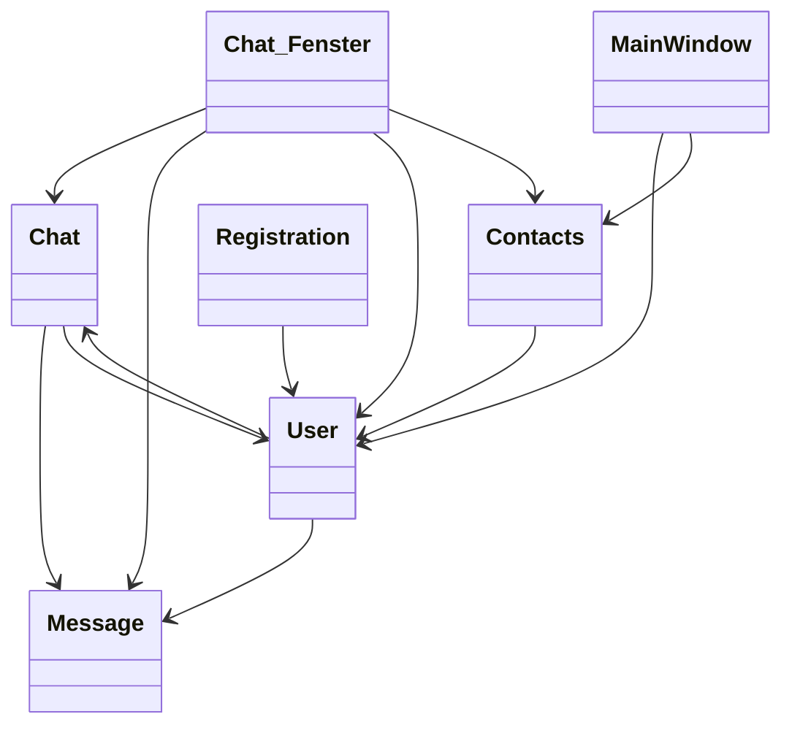
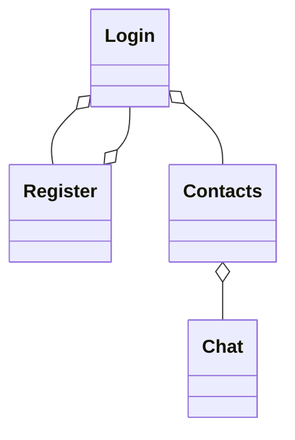
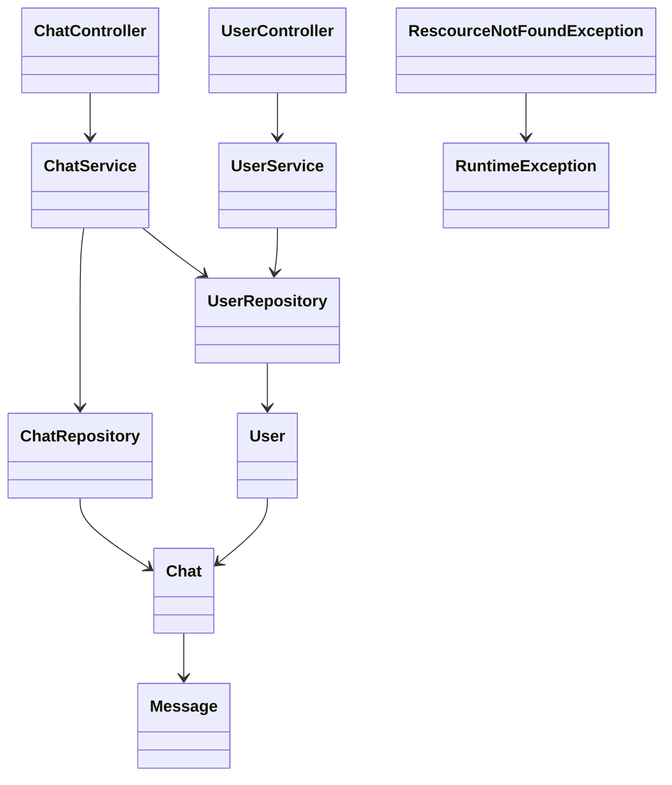

# Dokumentation Semesterprojekt Thor

## Softwaredesign (Architektur) 
Das Chat-Programm besteht aus einer Client-Server-Architektur.Diese wurde implementiert mit zwei Clients, einer WPF-Anwendung geschrieben in C# und einer WebApp umgesetzt mit JavaScript, CSS und HTML. Die API (welche auf Spring Boot basiert) nimmt Client Anfragen an via Endpoints und sendet eine Antwort. Die Daten von den Clients werden alle in einer MongoDB-Datenbank gespeichert.



## Beschreibung der Software 

Die Software ist eine einfache Chatapp Namens ThorChat. Sie besteht aus zwei Clients(einen WPF und Web-Client) sowie einer API welche die Daten an eine MongoDB Datenbank sendet und diese auch wieder zurück holen kann. Die Benutzeroberfläche ist simple und intuativ.

### Funktionen des WPF-Clients

Hier wird jetzt die Funktionsweise des Frontends in Detail durchgegangen. Weil beide Clients über die selben Funktionen verfügen wird die Funktionsweiße der Software mithilfe der WPF Version gezeigt um Renduanz zu vermeiden.

#### Login


In dem Eingabefeld mit den Titel **"Username"** gibt man den Benutzernamen des zu verwendeten Users ein
In dem Eingabefeld mit dem Titel **"Password"** gibt man das Passwort des zu verwendeten Users ein
Wenn man auf den **Register** Link drückt, dann wird man zum Registrieren-Fenster weitergeleitet
Wenn man auf den auf **'Login'** Button drückt, dann wird überprüft, ob der User existiert und ob das Passwort stimmt

#### Registrieren


In dem Eingabefeld mit dem Titel **"Username"** gibt man den Benutzernamemn des neu zu erstellenden Users ein
In dem Eingabefeld mit dem Titel **"Password"** gibt man das Passwort des neu zu erstellenden Userss ein
Wenn man auf den **Einloggen** Knopf drückt, dann wird man zum Einloggen-Fenster weitergeleitet<
Wenn man auf den **Passwort vergessen?** Knopf drückt, dann wird man zum PasswortForgotten-Fenster weitergeleitet
Wenn man auf den **Konto löschen** Knopf drückt, dann wird man zum BenutzerLöschen-Fenster weitergeleitet
Wenn man in dem Passwort-Feld auf **'Enter'** drückt, dann wird überprüft, ob noch kein Benutzer mit diesem Namen existiert

#### Kontakte


In den leeren Eingabefeld gibt man den gesuchten Namen eines neuen Kontakts ein
Wenn man auf den **Add Contact** Knopf drückt, wird ein neuer Kontakt hinzugefügt wenn ein User mit den gesuchten Namen existiert
Wenn man auf einen der Namen in der Kontaktliste drückt, dann wird ein Chatfenster geöffnet

#### Chatfenster


In den leeren Eingabefeld gibt man seine Nachricht ein
Wenn man auf den **Send** Knopf drückt, wird die Nachricht vom User versendet
Wenn man auf den **Delete Chat** Knopf drückt, dann wird die aktuelle Chat-ID gelöscht aus der Chat_ID Liste des Users. Der Andere Chatteilnehmer kann aber immer noch auf den Chat zugreifen


## API-Beschreibung 

Die API ist eine Spring Boot Rest API welche über Endpoints zugriff auf ihre Funktionen ermöglicht auf ihre Funktionen. Diesen Funktionen werden entweder Pfadvariablen oder Requestbodies übergeben, welche dann von den Funktionen verarbeitet werden. Die API sendet nach Ausführung der jeweiligen Funtkion, den jeweiligen CLient eine Antwort ob die von ihm erwünschte Funktion das gewollte ausführen konnte.

### Beispiel für einen Endpoint
<!-- Genereller Endpoint der API-->
<details>
  <summary>ThorChat[]</summary>
  
  **Beschreibung:** Dieser Endpunkt ist der generelle Endpoint der API, welcher vor jedem spezifischen Endpoint geschrieben werden muss.
</details>
<!-- Benutzer -->
<details>
  <summary>/contacts [PUT]</summary>
  
  **Beschreibung:** Dieser Endpunkt dient dazu, um einen Kontakt zu einen User hinzuzufügen. Diesen Endpoint wird ein Username übergeben welcher als die ID eines Users dient, weil es immer nur einen Usernamen geben kann.

  **Java Methode**
  ```java
    @Operation(summary = "PUT Operation to add an Contact")
        @PutMapping("/contacts")
        public User addContact(@RequestBody String data){
            return userService.newContact(data);
        }
  ```
  
  **JSON-Body:**
  ```json
  {
     "currentUser": Beispiel-Name,
     "newContact": Beispiel-Name-Kontakt
  }
  ```

  **Return-Wert:**
  ```json
  {
    "username": Beispiel-Name-Kontakt,
    "password": Beispiel-Password,
    "chat_IDs": Beispiel-ChatID-Liste,
    "contacts":
  }
  ```
</details>


## Verwendung der API 

### Beispiel der Verwendung der API anhand des Logins in der Webapp

<details>
<Summary>WebApp-Client</summary>

  **Beschreibung:** Login von dem WebApp-Client aus

  **JS-Code:**
```js
    //Variablen für User-Input
    let username=  ' ';
    let password =  ' ';

    //Bei dieser Funktion werden die Daten vom User an die passenden Variablen übergeben
    function handleInputChange(event) {
    const { id, value } = event.target;
    switch (id) {
        case 'usernameInput':
            username = value;
            break;
        case 'passwordInput':
            password = value;
            break;
        default:
            break;
    }
    }

    //Hier wird die Input Eingabe behandelt. Bei Eingabe wird diese an eine Funktion übergeben
    document.getElementById('usernameInput').addEventListener('input', handleInputChange);
    document.getElementById('passwordInput').addEventListener('input', handleInputChange);

   // Diese Funktion wird beim Login-Formular-Submit aufgerufen
    function login(e) {
    // Verhindert das Standardverhalten des Formulars (Seitenneuladung)
    e.preventDefault();

    // DIe IF-Abfrage überprüft, ob die Eingabefelder für Benutzername und Passwort nicht leer sind
    if (username.trim() !== "" && password.trim() !== "") {
        // Setzt die Fehlermeldung zurück, falls vorhanden
        document.getElementById('invalidinput').textContent = "";

        // Erstellt die URL für die API-Anfrage mit Benutzername und Passwort
        let url = `http://localhost:8080/ThorChat/users/${username}/${password}`;
        console.log(url); // Gibt die URL zur Debugging-Zwecken in der Konsole aus

        // Sendet eine GET-Anfrage an die erstellte URL
        $.get(url, (data, status) => {
            console.log(data); // Gibt die erhaltenen Daten zur Debugging-Zwecken in der Konsole aus

            // Überprüft, ob die Daten nicht null sind (Benutzer ist authentifiziert)
            if (data != null) {
                // Speichert die Benutzerdaten im lokalen Speicher des Browsers
                localStorage.setItem('user', JSON.stringify(data));

                // Leitet den Benutzer zur "contacts.html"-Seite weiter
                location.replace("./contacts.html");
            }
        });
    }
}

```

</details>


## Diagramme

### Klassendiagramm des WPF-Clients


### Klassendiagramm des WebApp-Clients


### Klassendiagramm des Spring-Boot Servers



## Diskussion der Ergebnisse

Nach 3 Monaten Projektarbeit konnte eine funktionierende Chatapp names ThorChat programmiert werden, die ich Ihnen nun präsentieren kann und es konnten fast alle Projektziele erfüllt werden, welche am Anfang des Projekts gesetzt wurden. Es war aufgrund von Zeitmangels und wegen des damit verbundenen Aufwandes war es nicht möglich bis zum Projektende es zu ermöglichen mit der Chatapp Videos, Gifs und Emojies zu versenden. Die geplante Funktionalität der Auswahl eines Dark und Lightmodes musste für die Sicherstellung der Fertigstellung der Wichtigsten Funktionen, der Chatapp bevor Projektendes auf Eisgelegt werden. 

### Zusammenfassung

ThorChat stellt eine intuitive Benutzeroberfläche für sämtliche Platformen zur Verfügung. Die Spring-Boot REST-API ermöglicht eine Kommunikation zwischen den Clients und der Datenbank.

### Hintergründe

Während der Entwicklungszeit der Chatapp wurde der Fokus auf ein intuitives Benutzerfreundliches Design gelegt sowie auf eine schnelle Echtzeitverbindung mit der API.Die Verwendung aktueller Technologien wie WPF, HTML, CSS, JSON & JavaScript und Spring-Boot gewährleistet ein zukünftige Unterstützung der Software. Die Nutzung einer MongoDB-Datenbank sorgt zudem für eine verlässliche Speicherung der Daten.

### Ausblicke

In Zukünftigen Version soll die Chatapp auch Dateienübertragung (Video, Fotos, Gifs) sowie Emojies unterstützen. Des weiteren sollte es die Wahl zwischen einen Light und Darkmode geben. Weiters ist eine Homesite für die Chatapp geplant, die es ermöglichen soll auf jede Funktionalität der Chatapp zuzugreifen und davon zurück zukehren. Dies wäre eine Abkehr des aktuellen sehr linearen Aufbaus der Chatapp


## Quellenverzeichnis

### WPF-Client

#### [WPF](https://learn.microsoft.com/en-us/visualstudio/get-started/csharp/tutorial-wpf?view=vs-2022)
#### [C#](https://www.w3schools.com/cs/index.php)

### Webapp-Client

#### [HTML & CSS](https://www.youtube.com/watch?v=hlwlM4a5rxg&list=PL4G5QRcvyrs9OoyIGfdLnQq1ACd-NkDKU)
#### [HTML](https://www.w3schools.com/html/)
#### [CSS](https://www.w3schools.com/css/default.asp)
#### [JAVASCRIPT](https://www.w3schools.com/js/default.asp)

### Spring-Boot Rest API

#### [Spring-Boot Rest](https://www.youtube.com/watch?v=e-TIQnK2Qg4&list=PL4G5QRcvyrs9OoyIGfdLnQq1ACd-NkDKU&index=2)
#### [Spring Dependencies](https://start.spring.io/)

### IDES

#### [IntelliJ IDEA 2022.2.1](https://www.jetbrains.com/idea/download/other.html)
#### [Visual Studio Code 1.89.1](https://code.visualstudio.com/download)
#### [Visual Studio 2022 17.9.7](https://visualstudio.microsoft.com/de/thank-you-downloading-visual-studio/?sku=Community&channel=Release&version=VS2022&source=VSLandingPage&cid=2030&passive=false)
