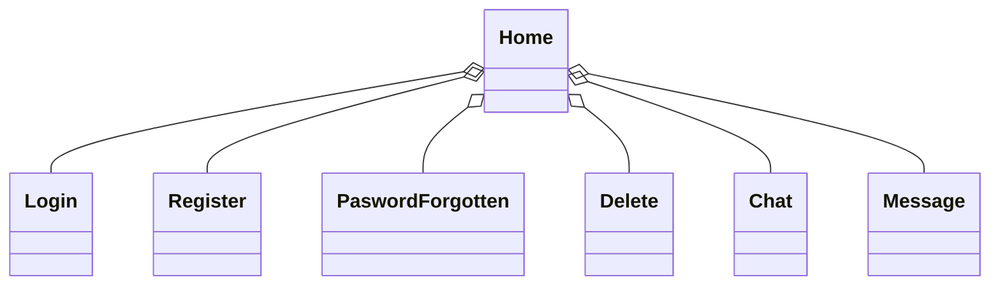
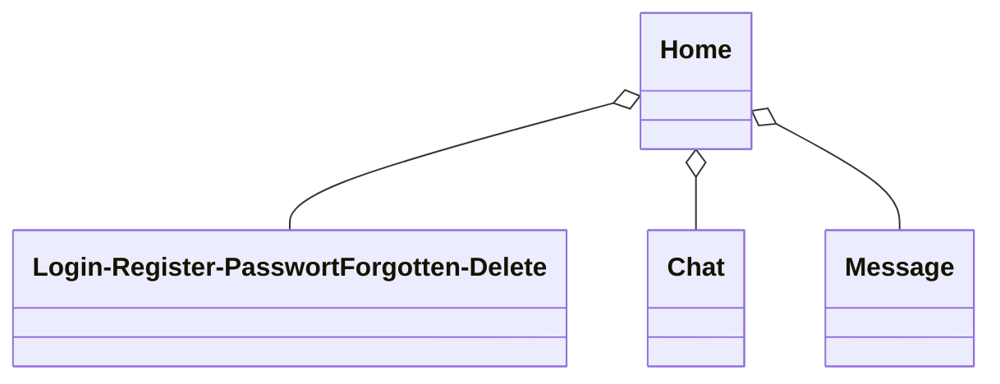
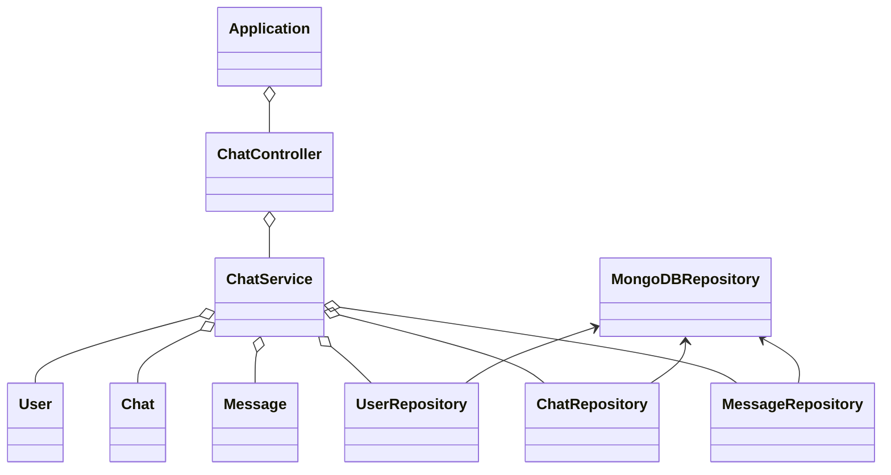

# Dokumentation Semesterprojekt Thor

## Softwaredesign (Architektur) 
Das Chat-Programm besteht aus einer Client-Server-Architektur.Diese wurde implementiert mit zwei Clients, einer WPF-Anwendung geschrieben in C# und einer WebApp umgesetzt mit JavaScript, CSS und HTML. Der Server (welcher auf Spring Boot basiert) kommunizieren. Die Daten werden alle in einer MongoDB-Datenbank gespeichert.

## Beschreibung der Software 

## API-Beschreibung 
Die API ist eine Spring Boot Rest API welche über Endpoints es ermöglicht 
## Verwendung der API 

## Diagramme

### Klassendiagramm des WPF-Clients

### Klassendiagramm des WebApp-Clients

### Klassendiagramm des Spring-Boot Servers

## Diskussion der Ergebnisse

## Quellenverzeichnis

### WPF-Client

#### [WPF](https://learn.microsoft.com/en-us/visualstudio/get-started/csharp/tutorial-wpf?view=vs-2022)
#### [C#](https://www.w3schools.com/cs/index.php)

### Webapp-Client

#### [HTML & CSS](https://www.youtube.com/watch?v=hlwlM4a5rxg&list=PL4G5QRcvyrs9OoyIGfdLnQq1ACd-NkDKU)
#### [HTML](https://www.w3schools.com/html/)
#### [CSS](https://www.w3schools.com/css/default.asp)
#### [JAVASCRIPT](https://www.w3schools.com/js/default.asp)
#### [JAVASCRIPT](https://www.geeksforgeeks.org/how-to-make-simple-put-request-using-fetch-api-by-making-custom-http-library/)

### Spring-Boot Rest API

#### [Spring-Boot Rest](https://www.youtube.com/watch?v=e-TIQnK2Qg4&list=PL4G5QRcvyrs9OoyIGfdLnQq1ACd-NkDKU&index=2)
#### [Spring-Boot Rest](https://spring.io/guides/tutorials/rest)
#### [Spring Dependencies](https://start.spring.io/)

### IDES

#### [IntelliJ IDEA 2022.2.1](https://www.jetbrains.com/idea/download/other.html)
#### [Visual Studio Code 1.89.1](https://code.visualstudio.com/download)
#### [Visual Studio 2022 17.9.7](https://visualstudio.microsoft.com/de/thank-you-downloading-visual-studio/?sku=Community&channel=Release&version=VS2022&source=VSLandingPage&cid=2030&passive=false)
